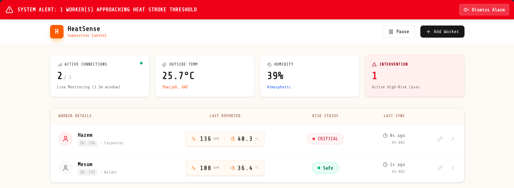
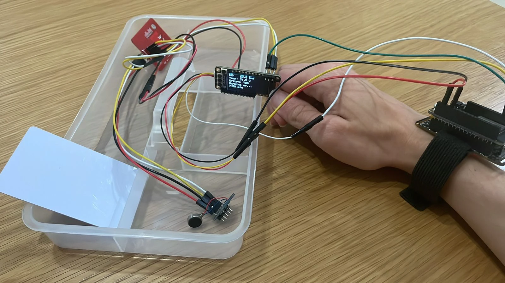

# HeatSense

**A wearable IoT system that detects and prevents heat stroke in outdoor workers in real time.**

HeatSense pairs a low-cost ESP32 wrist-worn device with a live supervisor dashboard. Each
wearable continuously measures a worker's heart rate and skin temperature, runs an on-device
machine-learning classifier to assess heat-stress risk, and streams the readings to a
cloud-hosted control room. Supervisors see every worker's vitals update live and are alerted
the moment anyone approaches the heat-stroke threshold - turning a slow, invisible medical
emergency into something a site manager can act on in seconds.

Built for the climate of the Gulf, where outdoor labour routinely happens in 45 °C+ heat.

> Senior Design capstone project - Department of Computer Science & Engineering,
> American University of Sharjah.

---

## Live demo

**[heatsense.vercel.app](https://heatsense.vercel.app)**

Click **"Explore read-only demo"** on the login page for instant one-click access. No
credentials required - it signs you into a read-only account where every view works but
data-changing actions (add / edit / delete worker) are disabled, so the demo data stays
intact for the next visitor.

---

## Demo

### Supervisor dashboard
Live monitoring of every connected worker, with risk status, last-reported vitals, and an
audible system alarm when a worker enters the critical zone.



### The wearable
ESP32-based wrist device with a pulse sensor, skin-temperature sensor, OLED readout, a
thermal-discomfort input button, and a haptic motor for on-body alerts.



---

## How it works

```
 ┌────────────────┐   HTTPS / x-api-key   ┌──────────────────────┐   polling  ┌──────────────┐
 │ ESP32 wearable │ ───────────────────▶  │ Next.js /api/ingest  │ ◀───────── │  Supervisor  │
 │  HR · skin °C  │    JSON telemetry     │ Postgres (Prisma)    │ refresh()  │  dashboard   │
 │  on-device ML  │    every ~30 s        │ risk evaluation      │            │  + alarm     │
 └────────────────┘                       └──────────────────────┘            └──────────────┘
```

1. **Sense** - the wearable reads heart rate and skin temperature, and lets the worker flag
   thermal discomfort with a button.
2. **Classify** - an on-device ML model labels each reading `safe` or `critical`.
3. **Ingest** - telemetry is POSTed to `/api/ingest`, authenticated with a shared device key,
   validated for plausible ranges, and persisted.
4. **Alert** - the dashboard polls for fresh readings; a critical reading raises a site-wide
   alarm and flags the worker for intervention.

## Repository layout

| Path | What's inside |
|------|---------------|
| `app/`, `components/`, `lib/` | Next.js 16 web dashboard (App Router, React 19) |
| `app/api/ingest/` | Device telemetry ingest endpoint |
| `prisma/` | Database schema, migrations, and seed data |
| `scripts/` | Wearable simulators and demo playback tooling |
| `ml/` | Model training notebooks (Colab) and exported artifacts - see [`ml/README.md`](ml/README.md) |
| `firmware/` | ESP32 C++ firmware - see [`firmware/README.md`](firmware/README.md) |

## Tech stack

- **Web:** Next.js 16, React 19, TypeScript, Tailwind CSS
- **Data:** PostgreSQL (Neon serverless in production) via Prisma
- **Auth:** NextAuth (supervisor login, bcrypt-hashed credentials)
- **Hardware:** ESP32, pulse sensor, skin-temperature sensor, OLED display, haptic motor
- **ML:** trained in Python/Colab, deployed on-device

## Running the dashboard locally

```bash
# 1. Install dependencies
npm install

# 2. Configure environment (database, IOT_SECRET, auth secret)
cp .env.example .env   # then fill in values

# 3. Set up the database
npx prisma migrate dev
npx prisma db seed

# 4. Start the dev server
npm run dev
```

Open [http://localhost:3000](http://localhost:3000).

### Simulating a wearable

With no physical device on hand, you can drive the dashboard from the included simulators:

```bash
node scripts/simulate-wearable.js     # stream synthetic telemetry to /api/ingest
node scripts/demo/playback.js         # replay a recorded session with ML predictions
```

## Team

Senior Design capstone, Computer Science & Engineering - American University of Sharjah.
